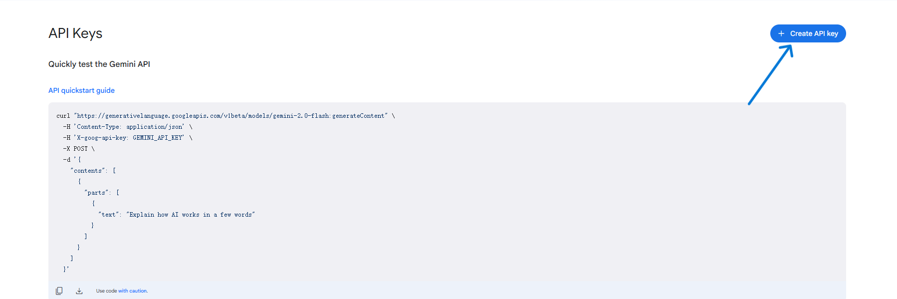
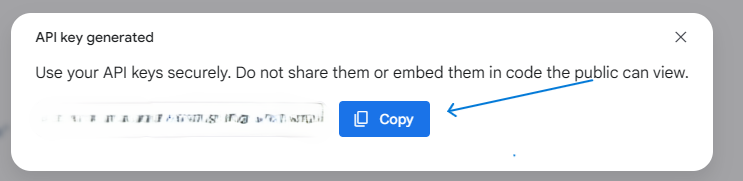

# Gemini-Chat-App
本项目是一个基于python构建的LLM聊天应用。使用customtkinter库构建GUI界面，并使用gemini-api与gemini模型进行聊天。
## 下载
在Release中下载最新版本的Gemini-Chat-App.zip压缩包，解压后填写api.txt文件中的api信息，运行Gemini-Chat-App.exe即可。
## api获取
1. 注册一个谷歌账号
   首先去google官网注册一个google的账号。当前账号申请需要使用手机验证码。这一步当前仅需梯子即可完成，进入GOOGLE主页，然后根据提示操作即可。
2. 开通gemini-api并获取api
   前往google ai-studio官网( https://aistudio.google.com/apikey )获取api。
   点击“+ create api key ”
   
   随后，在弹窗中选择Google Cloud Project的项目名为Gemini Api的项目，创建api
   
   复制获取到的api填入api.txt文件中。
   获取的免费api受到统一的配额限制：每天50次gemini-pro和1500次gemini-flash的响应。如需额外响应次数，敬请自行搜索付费方法。
## 使用须知
   由于谷歌官方api的限制，gemini-api仅在部分国家及地区允许使用，详情参见网站（ https://ai.google.dev/gemini-api/docs/available-regions?hl=zh-cn ），如果您需要在名单以外的国家或地区使用，请自行配置代理。
## 更新日志
- 2025.7.4 v1.0.0 实现基本功能 

# 欢迎提交Issues

